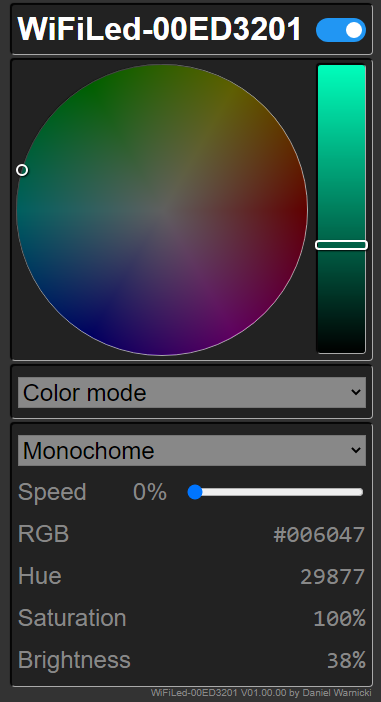

# WiFiLed

With this project, you can control an WS2812 RGB LED stripe (up to 300 LEDs) via your browser.<br>
The following features are realized.

* **browser control**<br>
  The device provides a webpage, where you can control the LED stripe (including simple animations).<br>
  
* **smooth on/off**<br>
  The LEDs will be turned on and off smoothly via a PT1 damping
* **optionally IR motion sensors**<br>
  Connect optionally two IR motion sensors to activate the LEDs by motion detection.
  After a defined time the LEDs will be durned off.
* **optionally IR distance sensors**<br>
  Connect optionally an IR distance sensor to control on/oof and the brightness.
  * fast moving across the distance sensor turns the LEDs on/off
  * static distance in front of the distance sensor changes the brightness

----
## Hardware
The following main devices are used in the schema:

1. **Wemos D1 mini**: ESP-8266 CPU<br>
    doc: https://www.wemos.cc/en/latest/d1/d1_mini.html
2. **WS2812B**: single addressable LED-stripe<br>
   doc: [data sheet](/doc/WS2812B.pdf)
3. **74AHC125**: level shifter 3V->5V<br>
   doc: [data sheet](/doc/74AHC125.pdf)
4. **AM312**: IR motion sensor<br>
   doc: [data sheet](/doc/AM312.pdf)
5. **GP2Y0A21YK0F**: IR distance sensor<br>
   doc: [data sheet](/doc/GP2Y0A21YK0F.pdf)

### circuit diagram
```text
                               ┌─────────────────────────────────────O──────┐
                               │        ╔═════════════════════════╗  │      │
                               │     ┌──║1 1/OE  74AHC125  Vcc V14║──┘Vcc   │
                               │  ┌──│──║2 1A              4/OE 13║         │
                         ┌────────│──│──║3 1Y                4A 12║         │
                         │     │  │  │  ║4 2/OE              4Y 11║         │
                         │     │  │  │  ║5 2A              3/OE 10║         │
                         │     │  │  │  ║6 2Y                3A  9║         │
                         │     │  │  O──║7 GND               3Y  8║         │
                         │     │  │  │  ╚═════════════════════════╝         │           AM312 ╔═╗
                         │     │  │  └────────────────────────────────O────┐│           ╔═════╣  ║
                         │     │  └─────────────────────────────┐     │    │O───────────║5V   ║   ║ AM312
                         │     │       ┌────────────────────────│─────│────││───────────║OUT  ║   ║ motion sensor 2
                         │     │       │  ╔══════════════════╗  │     │    O│───────────║GND  ║   ║
   ╔═════════════════╗   │     │       │  ║  WeMos D1 mini   ║  │    ╔═╗   ││           ╚═════╣  ║
   ║               5V║───│─────O       │  ║RST             Tx║  │  1M║ ║   ││                 ╚═╝
   ║ GP2Y0A21YK0F Out║───│──O──│───────│──║A0              Rx║  │    ╚═╝   ││           AM312 ╔═╗
   ║              GND║─┐ │  │  │       O──║D0              D1║──┘     │    ││           ╔═════╣  ║
   ╚═════════════════╝ │ │  │  │       │  ║D5              D2║────────O    │└───────────║5V   ║   ║ AM312
                       │ │  │  │      ╔═╗ ║D6              D3║        └────│────────────║OUT  ║   ║ motion sensor 1
                       │ │  │  │    1M║ ║ ║D7              D4║             O────────────║GND  ║   ║
                       │ │  │  │      ╚═╝ ║D8             GND║────────O────┘            ╚═════╣  ║
                       │ │  │  │       │  ║3V3             5V║──┐     │                       ╚═╝
                       │ │  │  │       │  ╚══════════════════╝  │     │
                       │ │  │  │       │                        │     │     ╔═════════════════╗
                       │ │  │  └───────│────────────────────────O─────│─────║5V               ║
                       │ └──│──────────│────────────────────────│─────│─────║IN WS2812 Stripe ║
                       └────│──────O───O────────────────────────│─────O─────║GND              ║
                            │      │                            │     │     ╚═════════════════╝
                            │      │                            │     │
                            O─═║║═─O                            │     │
                            │ 100nF│                            │     │
                            └─═║║═─┘                            │     │
                              100nF                            (5V) (GND)

```

----
## Compile & Flash

1. open **WiFiLed.ino** in [Arduino IDE](https://www.arduino.cc/en/software)
1. select board **LOLIN(WEMOS) D1 R2 & mini**
1. install the following libraries:

    * [Adafruit NeoPixel](https://www.arduinolibraries.info/libraries/adafruit-neo-pixel)
    * [WebSockets](https://www.arduinolibraries.info/libraries/web-sockets)
    * [WiFi](https://www.arduinolibraries.info/libraries/wi-fi)
1. connect device **Wemos D1 mini** via USB
1. configured the connected COM port in [Arduino IDE](https://www.arduino.cc/en/software) (menue: tools/port)
1. upload ESP8266 Sketch Data (menue: tools/ESP8266 Sketch Data Upload)
1. compile an link the code via [Arduino IDE](https://www.arduino.cc/en/software)
2. upload the code via [Arduino IDE](https://www.arduino.cc/en/software)

## Debug output
This project sends a lot of debug information via the serial interface. These data will be sent with **115200 baud**.<br>
You can control which information should be sent, when you change the `DEBUG_LEVEL`in file [DebugLevel.h](https://github.com/DaWaGit/WiFiLed/blob/main/DebugLevel.h)

https://github.com/DaWaGit/WiFiLed/blob/254f0afaa68c07f04bf132d93f9b39f9108e120c/DebugLevel.h#L1

----
## Getting Started
When you turn on as first time, follow the next steps, to connect the device in your WiFi:

1. The blue onboard LED is blinking slowly to inform you, a Wifi-Access-Point was started.
1. Search and connect your mobile device with an WiFi-Access-Point named `WiFiLed-\<DeviceId\>`<br>
   | name     | value                |
   | -------- | -------------------- |
   | SSID     | WiFiLed-\<DeviceId\> |
   | Password | none                 |
   | Url      | http://192.168.1.4/  |

1. Open in your browser the page http://192.168.1.4/
1. In **WiFi Setup** add your WiFi SSID and password and press **Success**
1. The device starts new, but with a fast blinking onboard LED to inform you, the connection to your WiFi is trying
1. When the WiFi connection is successfully established, the onboard LED is static on.<br>

   * Search in your router the IP from device
   * open the IP in your browser to control the LED stripe
1. When the WiFi connection fails after 3 minutes, the device will restart, but im WiFi-Access-Point mode (slow blinking onboard LED)<br>
   Repeat all steps from begin
